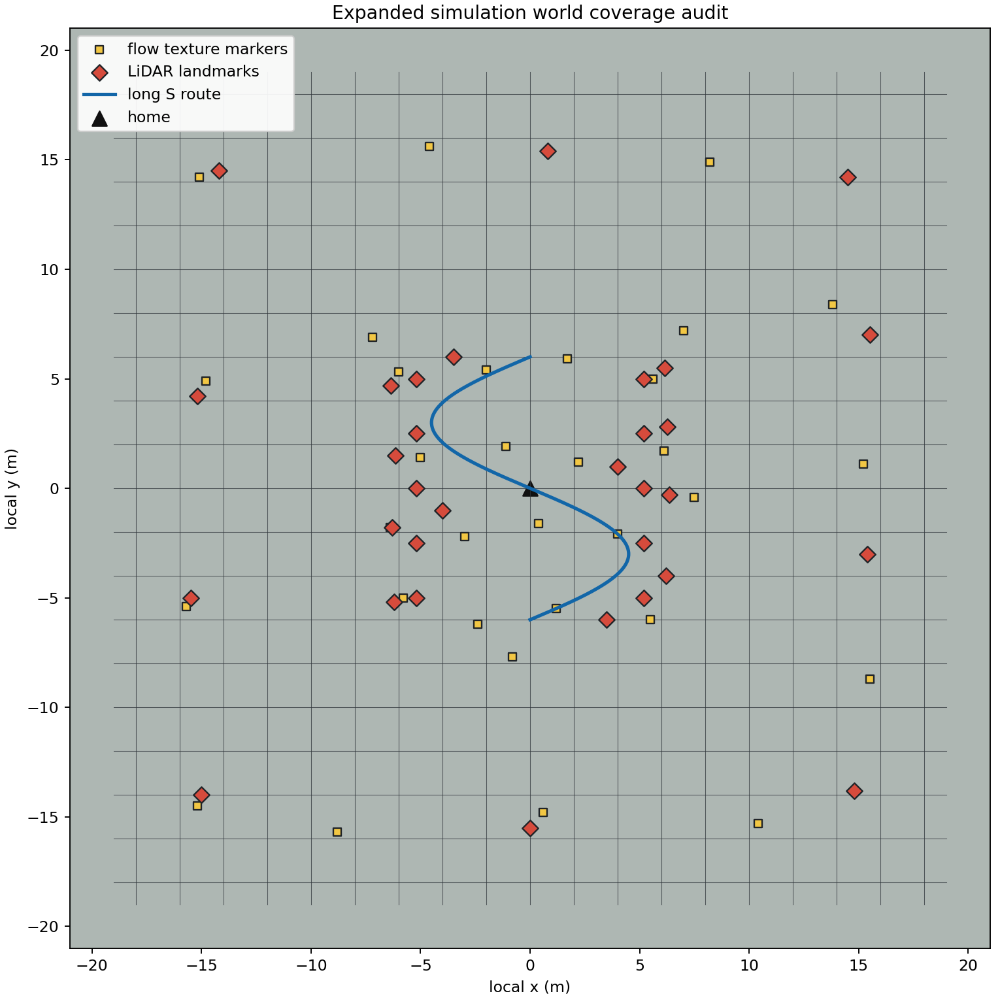

# 多传感器无人机 SLAM 仿真：快速配置版

本页用于新电脑直接复现。除第一次启动 Ubuntu 时输入用户名 `zyc`、鱼香 ROS 菜单选择“ROS 2 Humble 桌面版”外，下面命令均可原样复制，不需要修改路径。

零基础解释、组件作用和排错见 [详细配置教程](README_详细配置教程.md)。

## 1. 安装内容

| 组件 | 用途 | 安装方式 |
|---|---|---|
| WSL2 Ubuntu-22.04 | Windows 上的 Linux 运行环境 | PowerShell 安装到 D 盘 |
| ROS 2 Humble | 节点、话题、TF 和工具 | 鱼香 ROS 一键安装 |
| Gazebo Sim Harmonic | 三维场景、物理和传感器 | 项目脚本从 OSRF 官方源安装 |
| MAVROS2 | ROS 2 与 ArduPilot 的通信桥 | 项目脚本安装 Humble 软件包和 GeographicLib 数据 |
| ArduPilot Copter SITL | APM 飞控仿真 | 项目脚本下载固定版本并编译 |
| ArduPilot Gazebo | 飞控与 Gazebo 的动力学接口 | 项目脚本下载固定版本并编译 |
| D435i 与 MID360 | RGB-D、IMU 与三维激光雷达仿真 | 已包含项目专用模型与桥接源码 |
| FAST-LIO 地图包 | 激光里程计、注册点云与栅格地图 | 项目脚本下载 FAST-LIO、Livox 驱动和 SDK 并编译 |
| 默认仿真地图 | 简单场景、隧道和 ArduPilot 仓库 | 已包含在本仓库 |
| 可选大型地图 | Clearpath 场景与城市地形 | 单独一条脚本按需下载，不上传 GitHub |

## 2. Windows 安装 WSL2 到 D 盘

以管理员身份打开 PowerShell，复制执行：

```powershell
wsl --update
wsl --install -d Ubuntu-22.04 --location D:\WSL\Ubuntu-22.04
```

安装完成后重启电脑。第一次打开 Ubuntu-22.04 时，Linux 用户名输入：

```text
zyc
```

以后从 PowerShell 进入 Ubuntu：

```powershell
wsl -d Ubuntu-22.04
```

下面所有 `bash` 命令都在 Ubuntu 终端执行。

## 3. 安装 ROS 2 Humble

在 Ubuntu 终端复制执行：

```bash
sudo apt update
sudo apt install -y wget
wget http://fishros.com/install -O fishros && . fishros
```

在鱼香 ROS 菜单中选择“安装 ROS” -> “ROS 2” -> “Humble” -> “桌面版”。完成后关闭当前 Ubuntu 终端，再重新进入：

```powershell
wsl -d Ubuntu-22.04
```

## 4. 一键安装全部仿真组件

回到 Ubuntu 终端，整段复制执行：

```bash
sudo apt update
sudo apt install -y git
mkdir -p "$HOME/projects"
cd "$HOME/projects"
git clone https://github.com/Zhuyicheng-HIT/multi-slam-simulation.git
cd "$HOME/projects/multi-slam-simulation"
bash tools/setup_ubuntu.sh
```

该脚本会自动完成以下工作：

- 安装 Gazebo Harmonic、MAVROS2、RGB-D、RViz、PCL 与编译依赖；
- 下载并编译固定版本 ArduPilot Copter SITL；
- 下载并编译 ArduPilot Gazebo 插件；
- 下载并安装 Livox-SDK2；
- 下载并编译 Livox ROS Driver 2 与 FAST-LIO；
- 编译本仓库的三个 ROS 2 包并执行仓库检查。

外部大型源码默认保存在 `$HOME/ardupilot`、`$HOME/ardupilot_gazebo` 和 `$HOME/multi-slam-deps`，不会被提交到本仓库。

## 5. 稳定启动入口

本节中的 `tools/*.sh` 是项目公共启动接口。后续可以调整内部节点、参数和
话题桥，但应保持这些命令可用。若关键架构调整确实无法兼容旧命令，必须在
同一个版本中更新本节和迁移说明，并在合并或发布前明确告知，不允许静默失效。

### 5.0 五源统一后端 + EKF3 一键严格验证

已完成环境恢复并配置 `cuf_ws` 的机器，使用下面一条命令启动当前仿真稳定
候选。它会启动完整五源栈、执行一次短矩形、让 EKF3 消费 ExternalNav、记录
评测证据并在落地解锁后自动清理子进程：

```bash
cuf_ws && bash tools/run_stable_five_source_validation.sh
```

退出码为零才表示轨迹精度、五类因子、ExternalNav 连续性、EKF3 消费、TF
契约和落地解锁全部通过。当前稳定默认只监测在线时标，不自动改写传感器时间。
详细边界与已验证指标见
[`docs/STABLE_FIVE_SOURCE_EXTERNALNAV_20260816.md`](docs/STABLE_FIVE_SOURCE_EXTERNALNAV_20260816.md)。

### 5.1 基础 Gazebo + FAST-LIO 可视化

打开第 1 个 Ubuntu 终端，启动 Gazebo、APM、MAVROS2、D435i、MID360 和光流：

```bash
cd "$HOME/projects/multi-slam-simulation"
bash tools/run_sim_with_flow.sh
```

该入口默认加载仅用于 SITL Iris 模型的滚转稳定参数，避免原生参数在当前
Gazebo plant 上产生约 7.5 Hz 的滚转极限环；不会修改真实飞控。需要复现
ArduPilot 原生参数进行 A/B 时使用 `WIPE_EEPROM=1
ENABLE_IRIS_ROLL_STABILITY_PROFILE=0 bash tools/run_sim_with_flow.sh`。旧工作区首次
切换到稳定 profile 时也应运行一次
`WIPE_EEPROM=1 bash tools/run_sim_with_flow.sh`，之后恢复普通启动命令；这是因为
SITL EEPROM 中已保存的参数优先于 defaults 文件。定量依据见
[`docs/sensor_payload_pid_stability_report.md`](docs/sensor_payload_pid_stability_report.md)。

需要同时打开 100x100 光流画面和跟踪矢量时，将上一条启动命令改为：

```bash
cd "$HOME/projects/multi-slam-simulation"
SHOW_FLOW_WINDOW=1 bash tools/run_sim_with_flow.sh
```

打开第 2 个 Ubuntu 终端，启动自动起飞和矩形飞行状态机：

```bash
cd "$HOME/projects/multi-slam-simulation"
bash tools/run_rectangle_state_machine.sh
```

打开第 3 个 Ubuntu 终端，启动 FAST-LIO 建图与 RViz：

```bash
cd "$HOME/projects/multi-slam-simulation"
bash tools/run_fastlio_mapping.sh
```

长 S 航线是统一后端的严格闭环评测，不再允许只启动 FAST-LIO 后用
MAVROS/FCU local position 代替融合定位。命令名保持不变，但启动顺序调整为：

1. 第 1 个终端运行 `run_sim_with_flow.sh`；
2. 第 2 个终端运行统一后端专用的 FAST-LIO 前端入口：

```bash
cd "$HOME/projects/multi-slam-simulation"
RVIZ=0 bash tools/run_unified_fastlio_mapping.sh
```

普通 `run_fastlio_mapping.sh` 仍用于独立 FAST-LIO 建图展示，默认不发布原生点面
因子，不能代替上面的统一前端入口。

3. 第 3 个终端启动四源统一后端：

```bash
cd "$HOME/projects/multi-slam-simulation"
EXTERNAL_NAV_OUTPUT_TOPIC=/fusion/validation/externalnav \
  bash tools/run_unified_backend_stack.sh
```

4. 确认 `/fusion/unified/odom` 已输出后，第 4 个终端运行长 S 状态机：

```bash
cd "$HOME/projects/multi-slam-simulation"
bash tools/run_s_curve_state_machine.sh
```

航点误差、停留收敛和任务完成判断全部使用 `/fusion/unified/odom`
(`camera_init -> body`)。MAVROS local pose 只用于把误差表达成 APM 所需的 local
setpoint，不参与航线到达判断；Gazebo 真值只供事后评测。起飞前统一后端无输出、
frame 不匹配或时间戳过期时，状态机会在解锁前退出。飞行中出现同类定位丢失时，
状态机会冻结飞机当时的 FCU-local hold setpoint，至少保持 1 s 并等待恢复/重定位；
该安全保持不能推进航点，也不会回退到 GPS、FCU local pose 或 Gazebo 坐标完成航线。

稳定入口暂时保留 FAST-LIO 内部预测用于去畸变和前端匹配，但最终位姿、航线反馈和
地图插入确认属于统一后端。实验性的后端轨迹反向去畸变可通过
`FASTLIO_BACKEND_TRAJECTORY_FRONTEND=1` 单独 A/B；它在 2026-08-07 长航线测试中
出现请求/原生因子循环等待，尚未列入稳定默认值。

### 5.2 四源统一后端长 S 自动验证

下面的单条命令自动启动无界面仿真、LiDAR 前端、统一后端、三圈长 S 航线、
定量记录和退出清理。它默认不让 APM EKF3 消费 ExternalNav，适合算法验证，
不等同于闭环飞控验收：

```bash
cd "$HOME/projects/multi-slam-simulation"
VALIDATION_ROUTE=s_curve \
S_CURVE_PASSES=3 \
ENABLE_RELIABILITY_RECORD=1 \
bash tools/run_unified_rectangle_validation.sh
```

验证运行期间，可在另一个终端打开统一轨迹和点云 RViz：

```bash
cd "$HOME/projects/multi-slam-simulation"
bash tools/run_unified_visualization.sh
```

若还要看光流窗口，在自动验证命令前增加 `SHOW_FLOW_WINDOW=1`：

```bash
cd "$HOME/projects/multi-slam-simulation"
SHOW_FLOW_WINDOW=1 \
VALIDATION_ROUTE=s_curve \
S_CURVE_PASSES=3 \
ENABLE_RELIABILITY_RECORD=1 \
bash tools/run_unified_rectangle_validation.sh
```

`run_unified_rectangle_validation.sh` 的文件名为兼容旧实验保留；通过
`VALIDATION_ROUTE=s_curve` 选择长 S，无需改脚本名。

### 5.3 五源统一后端 + EKF3 单圈严格验收

下面的稳定候选入口同时启用飞控 IMU、MID360 原生点面因子、GNSS/BDS、
MTF-01P 风格光流和 D435i 重投影因子，并让 ArduPilot EKF3 实际消费唯一的
`/mavros/odometry/out`。航线只飞一圈短矩形；在线时间标定保留 shadow 诊断，
不会自动修改生产时间戳：

```bash
cd "$HOME/projects/multi-slam-simulation"
bash tools/run_stable_five_source_validation.sh
```

脚本会记录 rosbag2、检查五类因子均实际进入窗口、执行因果三维 ATE 验收、确认
MAVROS 坐标契约、EKF3 消费、降落和解锁，并清理本轮子进程。当前稳定候选的
边界、协方差/不断流策略、实测结果和上机前门槛见
[五源 ExternalNav 稳定候选报告](docs/STABLE_FIVE_SOURCE_EXTERNALNAV_20260816.md)。

## 6. 查看 RGB-D

彩色图：

```bash
source /opt/ros/humble/setup.bash
ros2 run rqt_image_view rqt_image_view
```

在下拉框选择 `/front/d435i/color/image_raw`。

深度图再打开一个终端执行相同命令，并选择 `/front/d435i/depth/image_rect_raw`。

FAST-LIO 的 RViz 会由第 3 个终端自动打开，正常时可以看到 `/cloud_registered`、轨迹和 `/fastlio_occupancy_grid`。

## 7. 下载可选大型地图

默认仿真和 FAST-LIO 不需要本节。需要 Clearpath 仓库、办公室、施工场景或城市地形时执行：

```bash
cd "$HOME/projects/multi-slam-simulation"
bash tools/fetch_optional_worlds.sh
```

下载后可直接启动示例：

```bash
cd "$HOME/projects/multi-slam-simulation"
bash install/multi_slam_worlds/share/multi_slam_worlds/scripts/run_named_world.sh clearpath_warehouse
```

## 8. 快速检查

```bash
source /opt/ros/humble/setup.bash
source "$HOME/projects/multi-slam-simulation/install/setup.bash"
ros2 topic echo --once /mavros/state
ros2 topic hz /front/d435i/color/image_raw
ros2 topic hz /sim/mid360/points_raw
ros2 topic hz /cloud_registered
```

光流矩形飞行期间量化检查 FAST-LIO 漂移、偏航/IMU耦合和点云突变：

```bash
cd "$HOME/projects/multi-slam-simulation"
source /opt/ros/humble/setup.bash
source install/setup.bash
python3 tools/analyze_slam_drift.py --duration 120
```

### 8.1 点云轨迹可视化与审计

启动第 3 个终端的 FAST-LIO 入口后，RViz 配置会显示注册点云、可靠点云、
局部地图、占据栅格和算法轨迹：

```bash
cd "$HOME/projects/multi-slam-simulation"
RVIZ=1 bash tools/run_fastlio_mapping.sh
```

关键话题和用途如下：

| 话题 | 用途 | 是否允许作为定位输入 |
|---|---|---|
| `/livox/lidar` (`livox_ros_driver2/msg/CustomMsg`) | MID360 兼容输入，含包时间和点时间偏移 | 是，FAST-LIO 输入 |
| `/cloud_registered` | FAST-LIO 去畸变/注册后的算法点云，坐标系通常为 `camera_init` | 是，供算法地图与视觉协作层使用 |
| `/fastlio_denoised_map` | 项目侧可靠性过滤后的局部地图 | 仅地图质量与可视化 |
| `/fastlio_occupancy_grid` | 注册点云生成的占据栅格 | 仅规划/可视化 |
| `/sim/mid360/cloud_registered` | Gazebo 真值注册点云 | 否，仅评估对照 |
| `/sim/mid360/ground_truth_odom` | Gazebo 真值位姿 | 否，仅评估对照 |

建议在运行前显式加载外部 Livox 消息类型支持，然后生成 JSON 审计报告：

```bash
source /opt/ros/humble/setup.bash
source "$HOME/multi-slam-deps/mid360_ws/install/setup.bash"
cd "$HOME/projects/multi-slam-simulation"
source install/setup.bash
python3 tools/analyze_slam_drift.py \
  --duration 120 \
  --wall-timeout 900 \
  --output /tmp/multi_slam_pointcloud_audit.json
```

报告将分别给出轨迹误差和点云质量：Livox 包点数 P05、有限点比例、机身剔除比例、
注册点坐标范围、连续帧体素重叠率、点云质心跳变、时间戳回退/重复以及 `/livox/lidar`
和 `/livox/imu` 发布者数量。发布者必须各为一个；点云坐标突然超过 80 m 或同时出现
质心大跳变与低体素重叠才判定为地图/位姿发散。长航线在场景边缘点数变少属于覆盖
告警，不会被误报为坐标发散；应通过增加环境几何或降低航线范围处理，不能用 Gazebo
真值修正轨迹。

主测试地图加入轻量静态拱门、短隧道、分段高墙走廊和非对称建筑立面，替换了
沿线重复标识柱。长 S 航线沿安全通道进出这些结构，并在 `4.0–6.0 m` 间完成两次
升降；进场和返场同样沿 S 曲线，不允许用直线捷径穿过墙体。仓库内的场景覆盖
审计图由 SDF、光流纹理和三维航线定义自动生成：



重新生成：

```bash
cd "$HOME/projects/multi-slam-simulation"
python3 tools/plot_s_curve_world_audit.py \
  --output docs/assets/s_curve_world_audit.png \
  --json docs/assets/s_curve_world_audit.json
```

## 9. 进一步阅读

- [五源 ExternalNav 稳定候选与严格验收](docs/STABLE_FIVE_SOURCE_EXTERNALNAV_20260816.md)
- [四源融合稳定候选版与视觉协作接口](docs/RELEASE_FOUR_SOURCE_V1.md)
- [LiDAR 点云稳定候选版与视觉点云接口](docs/RELEASE_LIDAR_POINTCLOUD_V1.md)
- [城市结构与统一后端严格航线验证](docs/urban_strict_route_validation_20260807.md)
- [详细配置教程](README_详细配置教程.md)
- [安装与依赖说明](docs/INSTALL.md)
- [运行与排错](docs/RUNNING.md)
- [系统架构](docs/ARCHITECTURE.md)
- [场景说明](docs/WORLDS.md)
- [GitHub 打包原则](docs/PACKAGING.md)

主仿真包采用 Apache-2.0；外部依赖遵循各自上游许可证。
